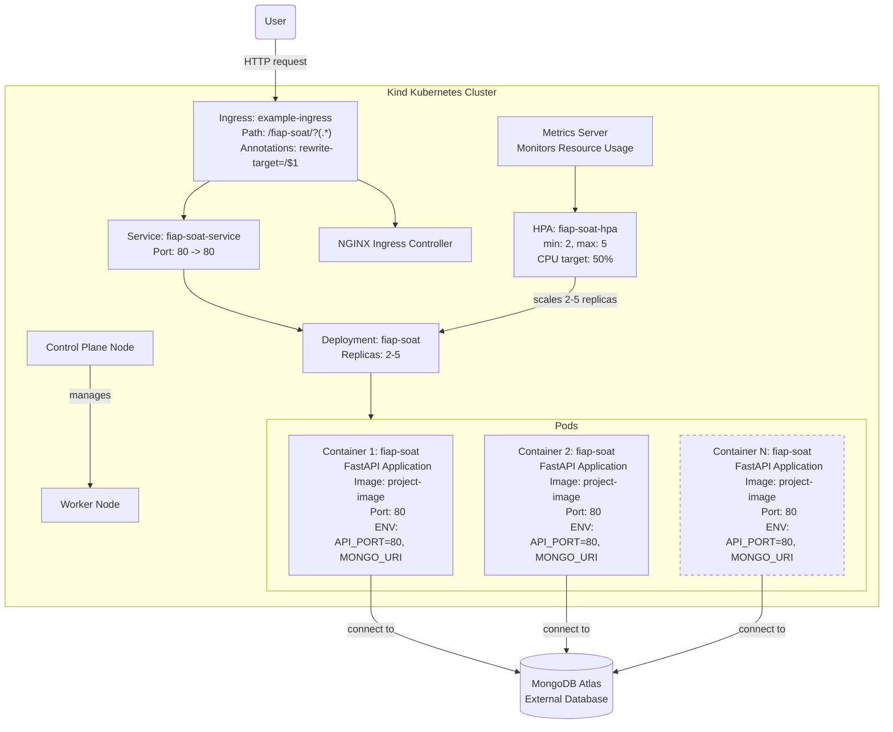

# fiap-tech-challenge

# Tech Challenge do curso Pós-Tech - Software Architecture | FIAP

## Sobre o Projeto

Este projeto é uma API RESTful desenvolvida em Python utilizando o framework FastAPI e banco de dados PostgreSQL. Foi criado aplicando os principais conceitos de arquitetura de software, como SOLID, DDD (Domain-Driven Design) e Clean Architecture.

Para uma explicação sobre a infraestrutura na AWS, assista o [Video](https://www.youtube.com/watch?v=avYM730vDaI). (to do)

Para uma explicação sobre a infraestrutura com Kubernetes com Kind localmente e demonstração do funcionamento da API, assista o [Video](https://www.youtube.com/watch?v=avYM730vDaI).

## Event Storming

Para visualizar o diagrama criado a partir dos eventos, consulte o [board no Miro](https://shorturl.at/3xRZ9).

## Arquitetura da infraestrutura

### Arquitetura do Projeto na AWS

O projeto foi desenvolvido para ser executado em um cluster Kubernetes na AWS. Para mais informações de como configurar e rodar, consulte o repositorio da infraestrutra provisionada usando terraform no [Github da infraestrutura](https://github.com/rafabernardo/fiap-tech-challenge-k8s-infra).


### Arquitetura do Projeto com Kubernetes com Kind localmente

O projeto foi desenvolvido para ser executado em um cluster Kubernetes com Kind localmente. Para mais informações de como configurar e rodar, consulte o
[README da infraestrutura](infrastructure/kubernetes/README.md).



## Requisitos Funcionais do Projeto

### 1. Identificação do Cliente

- **RF1.1**: O sistema deve oferecer a opção de cadastro com nome e e-mail.
- **RF1.2**: O sistema deve permitir que o cliente se identifique através do CPF.
- **RF1.3**: O sistema deve permitir que o cliente faça pedidos sem se identificar.

### 2. Seleção de Produtos

- **RF2.1**: O sistema deve apresentar os produtos disponíveis, categorizados em Lanche, Acompanhamento, Bebida e Sobremesa.
- **RF2.2**: Para cada produto, o sistema deve exibir nome, descrição e preço.
- **RF2.3**: O sistema deve permitir a montagem de combos na seguinte sequência, sendo todas as etapas opcionais:
  1. Lanche
  2. Acompanhamento
  3. Bebida
- **RF2.4**: O sistema deve permitir que o cliente pule qualquer etapa da montagem do combo ou finalize o pedido a qualquer momento.

### 3. Finalização do Pedido

- **RF3.1**: O sistema deve confirmar o recebimento do pagamento antes de processar o pedido.
- **RF3.2**: O sistema deve notificar a cozinha após a confirmação de pagamento.

### 4. Acompanhamento do Pedido

- **RF4.1**: O sistema deve exibir o status atual do pedido (Recebido, Em preparação, Pronto, Finalizado).
- **RF4.2**: O sistema deve atualizar o status do pedido em tempo real.
- **RF4.3**: O sistema deve notificar o cliente quando o pedido estiver pronto para retirada.

### 5. Gerenciamento de Produtos

- **RF5.1**: O sistema deve permitir cadastrar novos produtos, especificando nome, descrição, preço, categoria e imagem.
- **RF5.2**: O sistema deve permitir editar informações de produtos existentes.

### 6. Gerenciamento de Pedidos

- **RF6.1**: O sistema deve exibir uma lista de pedidos em andamento, ordenados por status (Recebido, Em preparação, Pronto) e em ordem decrescente de criação.
- **RF6.2**: O sistema deve permitir atualizar o status de cada pedido.
- **RF6.3**: O sistema deve fornecer o tempo de espera estimado para cada pedido.

## Configuração do Ambiente

1. Instale [Poetry](https://python-poetry.org/docs/) para gerenciamento de dependências.
2. Clone o repositório e navegue até a pasta do projeto.
3. Crie e ative um ambiente virtual:

   ```shell
   poetry shell
   ```

4. Instale as dependências:

   ```shell
   poetry install
   ```

   Para instalar apenas as dependências de produção, use:

   ```shell
   poetry install --no-dev
   ```

## Variáveis de Ambiente

Crie um arquivo `.env` na raiz do projeto com as seguintes variáveis:

<<<<<<< HEAD
| Variável | Descrição | Exemplo |
| ------------------- | ----------------------------- | -------------- |
| API_PORT | Porta de acesso à API | 8000 |
| POSTGRESQL_URL | URL de acesso ao MongoDB | localhost:5432 |
| POSTGRESQL_USERNAME | Database utilizada no MongoDB | database_test |
| POSTGRESQL_PASSWORD | Usuário de acesso ao MongoDB | user |
| POSTGRESQL_DATABASE | Senha de acesso ao MongoDB | pass |
=======
| Variável | Descrição | Exemplo |
| ---------------------- | ------------------------------------- | ------------- |
| API_PORT | Porta de acesso à API | 8000 |
| POSTGRESQL_URL | URL de acesso ao Postgres com a PORTA | localhost:5432|
| POSTGRESQL_USERNAME | Database utilizada no Postgres | database_test |
| POSTGRESQL_PASSWORD | Usuário de acesso ao Postgres | user |
| POSTGRESQL_DATABASE | Senha de acesso ao Postgres | pass |

> > > > > > > 5c527f52fc9474576d5387c96d03010f23843e33

## Execução do Projeto

Utilize o Makefile fornecido para executar o projeto. Certifique-se de ter o Make instalado em seu sistema.

1. Para compilar e executar o projeto:

   ```shell
   make start-up
   ```

2. Para limpar os arquivos gerados durante a compilação:

   ```shell
   make clean-up
   ```

Certifique-se de que as variáveis de ambiente estejam configuradas corretamente no arquivo `.env` antes de executar o projeto.

## Documentação da API

A documentação interativa da API (Swagger UI) pode ser acessada em `/docs` quando o projeto estiver em execução.

## Endpoints

### Users

- **GET /v1/users**: Lista todos os usuários.
- **GET /v1/users/{id}**: Obtém um usuário pelo ID.
- **GET /v1/users/cpf/{cpf}**: Obtém um usuário pelo CPF.
- **POST /v1/users/register**: Registra um novo usuário.
- **DELETE /v1/users/delete/{id}**: Deleta um usuário pelo ID.
- **PATCH /v1/users/identify/{id}**: Identifica um usuário pelo CPF usando seu ID.

### Products

- **GET /v1/products/**: Lista paginada de todos os produtos.
- **GET /v1/products/{id}**: Obtém um produto pelo ID.
- **DELETE /v1/products/{id}**: Deleta um produto pelo ID.
- **PATCH /v1/products/{id}**: Atualiza um produto pelo ID.
- **POST /v1/products**: Registra um novo produto.

### Orders

- **GET /v1/order/queue**: Lista paginada de itens na fila de pedidos.
- **GET /v1/order**: Lista paginada de todos os pedidos.
- **POST /v1/order**: Registra um novo pedido.
- **GET /v1/order/{id}**: Obtém um pedido pelo ID.
- **DELETE /v1/order/{id}**: Deleta um pedido pelo ID.
- **PATCH /v1/order/{id}**: Atualiza um pedido pelo ID.
- **PATCH /v1/order/fake-checkout/{order_id}**: Simula o pagamento de um pedido.
- **GET /v1/order/get_payment_status/{order_id}**: Obtém o status de pagamento de um pedido.
- **GET /v1/order/display-orders/**: Lista paginada de todos os pedidos ordenados por status e data de criação.
